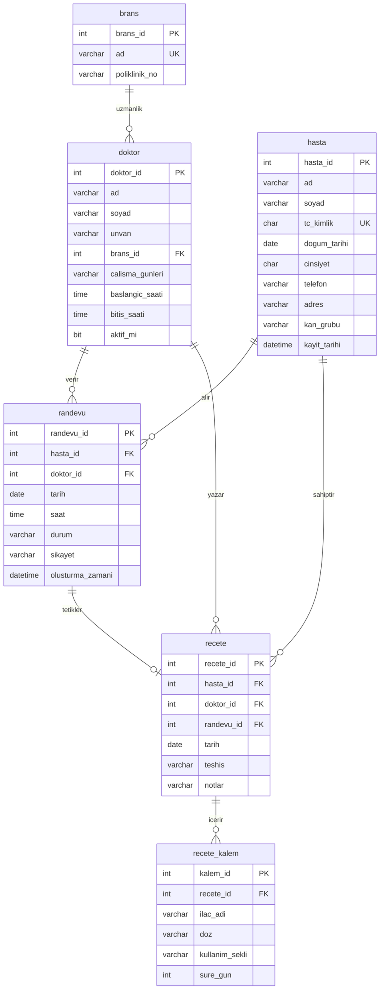

# Hastane Bilgi Sistemi ER Diyagrami

## Iliskiler

- Bir brans birden fazla doktora baglanabilir.
- Bir hasta birden fazla randevu alabilir.
- Bir doktor birden fazla randevu verebilir.
- Bir randevudan en fazla bir recete olusur.
- Bir recete birden fazla recete kalemi icerir.

## Kritik Kisitlar

- `hasta.cinsiyet` alani yalnizca `E` veya `K` degerlerini kabul eder.
- `randevu.durum` alani `Bekliyor`, `Tamamlandi`, `Iptal` degerlerinden biridir.
- `recete_kalem.sure_gun` pozitif olmak zorundadir.
- `UX_randevu_doktor_tarih_saat` index'i ayni doktor, tarih ve saate ikinci aktif randevuyu engeller.
